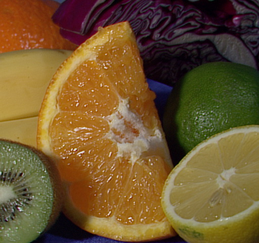

基于CUDA实现的高斯滤波
====================

该实现参考了OpenCV中“**cv::gpu::GaussianBlur**”的实现：

1. 支持1~4通道（可根据需要扩展）；

2. 支持1～4字节的各种通道数据类型；

3. 支持5种边界类型，即  
   BORDER\_REPLICATE:      aaaaaa|abcdefgh|hhhhhhh  
   BORDER\_REFLECT:        fedcba|abcdefgh|hgfedcb  
   BORDER\_REFLECT\_101:   gfedcb|abcdefgh|gfedcba  
   BORDER\_WRAP:           cdefgh|abcdefgh|abcdefg  
   BORDER_CONSTANT:        000000|abcdefgh|0000000

4. 放宽高斯核大小限制（小于32），取决于共享内存的大小；

以下是使用本人实现对fruits.jpg进行高斯滤波的处理结果（使用15x15的高斯核）：

- 原始图像  

- 高斯滤波图像  

基本上，在放宽高斯核大小的限制后，滤波函数的实现将会需要额外的数组边界指示器变量，并且循环不能展开（unroll）。当核的尺寸较小时，可以避免无用的访存，而当核的尺寸较大时，这点访存效率会被循环和条件分支带来的负面影响所淹没掉！

以下是使用不同分辨率的标准图像（3通道单字节）进行的效率测试：  

- CPU：Intel i7 3820QM （2.7~3.1GHz）；
- GPU：Nvidia GT 650M （950MHz / 2 Multiprocessors / 384 CUDA Cores）；

Test on image size (640 x 480), kernel size (3 x 3).  
OpenCV CPU implement use time 0.981271ms.  
OpenCV GPU implement use time 42.540381ms.  
Custom implement use time 1.667534ms.  

Test on image size (640 x 480), kernel size (7 x 7).  
OpenCV CPU implement use time 2.549595ms.  
OpenCV GPU implement use time 2.184037ms.  
Custom implement use time 1.885683ms.  

Test on image size (640 x 480), kernel size (9 x 9).  
OpenCV CPU implement use time 3.168615ms.  
OpenCV GPU implement use time 2.132265ms.  
Custom implement use time 1.951025ms.  

Test on image size (640 x 480), kernel size (13 x 13).  
OpenCV CPU implement use time 4.282357ms.  
OpenCV GPU implement use time 2.325022ms.  
Custom implement use time 2.179171ms.  

Test on image size (640 x 480), kernel size (15 x 15).  
OpenCV CPU implement use time 4.888339ms.  
OpenCV GPU implement use time 2.340531ms.  
Custom implement use time 2.159785ms.  

Test on image size (640 x 480), kernel size (31 x 31).  
OpenCV CPU implement use time 9.765616ms.  
OpenCV GPU implement use time 3.048498ms.  
Custom implement use time 3.113916ms.  

Test on image size (1920 x 1080), kernel size (3 x 3).  
OpenCV CPU implement use time 6.572636ms.  
OpenCV GPU implement use time 8.279474ms.  
Custom implement use time 6.900943ms.  

Test on image size (1920 x 1080), kernel size (7 x 7).  
OpenCV CPU implement use time 17.087006ms.  
OpenCV GPU implement use time 9.021614ms.  
Custom implement use time 8.264687ms.  

Test on image size (1920 x 1080), kernel size (9 x 9).  
OpenCV CPU implement use time 21.281518ms.  
OpenCV GPU implement use time 8.741202ms.  
Custom implement use time 7.961468ms.  

Test on image size (1920 x 1080), kernel size (13 x 13).  
OpenCV CPU implement use time 29.374012ms.  
OpenCV GPU implement use time 9.496760ms.  
Custom implement use time 9.415567ms.  

Test on image size (1920 x 1080), kernel size (15 x 15).  
OpenCV CPU implement use time 32.818516ms.  
OpenCV GPU implement use time 9.791122ms.  
Custom implement use time 10.097382ms.  

Test on image size (1920 x 1080), kernel size (31 x 31).  
OpenCV CPU implement use time 66.189075ms.  
OpenCV GPU implement use time 13.590236ms.  
Custom implement use time 15.909100ms.  

Test on image size (5616 x 3744), kernel size (3 x 3).  
OpenCV CPU implement use time 64.024425ms.  
OpenCV GPU implement use time 68.030095ms.  
Custom implement use time 59.883091ms.  

Test on image size (5616 x 3744), kernel size (7 x 7).  
OpenCV CPU implement use time 176.791633ms.  
OpenCV GPU implement use time 74.849768ms.  
Custom implement use time 71.755048ms.  

Test on image size (5616 x 3744), kernel size (9 x 9).  
OpenCV CPU implement use time 218.781718ms.  
OpenCV GPU implement use time 77.848851ms.  
Custom implement use time 74.311903ms.  

Test on image size (5616 x 3744), kernel size (13 x 13).  
OpenCV CPU implement use time 300.252930ms.  
OpenCV GPU implement use time 84.735273ms.  
Custom implement use time 88.851101ms.  

Test on image size (5616 x 3744), kernel size (15 x 15).  
OpenCV CPU implement use time 341.538241ms.  
OpenCV GPU implement use time 87.486596ms.  
Custom implement use time 95.126296ms.  

Test on image size (5616 x 3744), kernel size (31 x 31).  
OpenCV CPU implement use time 676.593478ms.  
OpenCV GPU implement use time 128.668782ms.  
Custom implement use time 153.406397ms.
